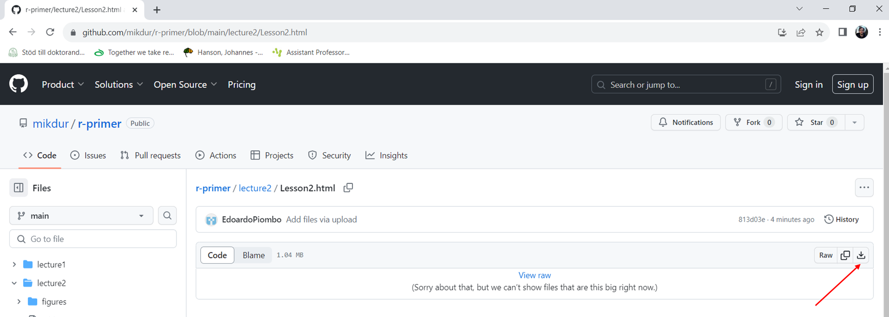

```{r setup, include=FALSE}
knitr::opts_chunk$set(echo = FALSE)
library('tidyverse')
library(writexl)
library(readxl)
```


## Data handling with Tidyverse
Today we will learn to:

- Import and export data
- Clean and reformat data
- Filter data
- Perform simple data mining on our datasets

The package that we are going to use is called tidyverse.

You can install it with:
```{r, eval=FALSE, echo=TRUE}
install.packages('tidyverse')
```
## What is tidyverse?
The tidyverse is a coherent system of packages for data manipulation, exploration and visualization that share a common design philosophy.

It contains several packages:
{width=70% height=70%}

We will see a few commands from **tibble** and several from **dplyr**.


## Tidy data
**Tidy data** is a standard way of mapping the meaning of a dataset to its structure.

In **tidy data**:

- Every column is a variable.

- Every row is an observation.

- Every cell is a single value.

Having **tidy data** can avoid problems in the future.

You can tidy your data directly from R or from excel.

## Steps in data handling 1
- <p style="font-size: 36px;">**Import data** </p>

- <p style="font-size: 36px;">Clean data </p>

- <p style="font-size: 36px;">Select and filter data </p>

- <p style="font-size: 36px;">Analyze data </p>

- <p style="font-size: 36px;">Export data </p>

## Let's import some data!
The most common format for data is tables.
In R, table objects are called dataframes.
Tidyverse has a specific type of dataframes, called **tibbles**.
The most common command to import **tibbles** is **read_tsv()**.
Remember, before starting to work, to activate the **tidyverse** package with the **library(tidyverse)** command.

```{r, eval=TRUE, echo=TRUE}
data <- read_tsv('dogs.txt', show_col_types = FALSE)
head(data, n=5)
```

## Let's import some data!
The command **head** shows the first 6 line of a tibble.
The option **n** allows you to specify a different number.

```{r, eval=TRUE, echo=TRUE}
data <- read_tsv('dogs.txt', show_col_types = FALSE)
head(data)
```

## Let's import some data!
The commands **nrow**, **ncol** and **dim** allow you to see the dimension of your tibble

```{r, eval=TRUE, echo=TRUE}
data <- read_tsv('dogs.txt', show_col_types = FALSE)
ncol(data)
nrow(data)
dim(data)
```


## You can import directly from excel
You need the package readxl, also part of tidyverse

```{r, eval=TRUE, echo=TRUE}
library(readxl)
data <- read_excel('dogs.xlsx')
head(data)
```

## You can import directly from tht web
All the files of this lesson are available at:
https://raw.githubusercontent.com/mikdur/r-primer/main/lecture2/

For example, to download 'dogs.txt', I can use **read_tsv** on https://raw.githubusercontent.com/mikdur/r-primer/main/lecture2/dogs.txt


## You can import directly from tht web
For example, to download 'dogs.txt', I can use **read_tsv** on https://raw.githubusercontent.com/mikdur/r-primer/main/lecture2/dogs.txt

```{r, eval=TRUE, echo=TRUE}
library(readxl)
data <- read_tsv('https://raw.githubusercontent.com/mikdur/r-primer/main/lecture2/dogs.txt', show_col_types = FALSE)
head(data)
```

## Useful options when importing data
The **na** option allows you to specify which strings indicate absent data

```{r, eval=TRUE, echo=TRUE}
data <- read_tsv('dogs.txt', na = c("", "NA", "na"), show_col_types = FALSE)
head(data, n=5)
```

## Useful options when importing data 2
The **comment** option allows you to specify which lines are comments and not contain real data

```{r, eval=TRUE, echo=TRUE}
data <- read_tsv('F_graminearum.gff', show_col_types = FALSE)
head(data, n=5)
```

## Useful options when importing data 2
The **comment** option allows you to specify which lines are comments and not contain real data

```{r, eval=TRUE, echo=TRUE}
data <- read_tsv('F_graminearum.gff', comment="#",
                 show_col_types = FALSE)
head(data, n=5)
```
## Useful options when importing data 2
The **col_names = FALSE** option allows you to not use the first line as column names

```{r, eval=TRUE, echo=TRUE}
data <- read_tsv('F_graminearum.gff', comment="#", col_names = FALSE,
                 show_col_types = FALSE)
head(data, n=5)
```

## Steps in data handling 2
- <p style="font-size: 36px;">Import data </p>

- <p style="font-size: 36px;">**Clean data** </p>

- <p style="font-size: 36px;">Select and filter data </p>

- <p style="font-size: 36px;">Analyze data </p>

- <p style="font-size: 36px;">Export data </p>

## Separate columns
```{r, eval=TRUE, echo=TRUE}
data <- read_tsv('dogs.txt', comment="#", na = c("", "NA", "na"),
                 show_col_types = FALSE)
head(data, n = 2)
data <- separate(data, OwnerCity, sep = "_", into = c("Owner", "City"),
                 convert = TRUE)
head(data, n=2)
```

## Separate columns
```{r, eval=FALSE, echo=TRUE}
data <- separate(data, OwnerCity, sep = "_", into = c("Owner", "City"),
                 convert = TRUE)
head(data, n=2)
```

```{r, eval=TRUE, echo=FALSE}
head(data, n=2)
```
The **convert** option is often useful because it automatically converts numeric columns to numeric format

## Replace NA

```{r, eval=TRUE, echo=TRUE}
head(data, n = 2)

dato <- replace_na(data, list(Weight_kg = 0))
head(dato, n=2)
```

## Remove NA

```{r, eval=TRUE, echo=TRUE}
head(data, n = 2)

data <- drop_na(data, Weight_kg)
head(data, n=2)
```

## Merge columns

```{r, eval=TRUE, echo=TRUE}
head(data, n = 2)
dato <- unite(data, Breed, Weight_kg, col='Breed and Weight', sep=':')
head(dato, n=2)
```

## Steps in data handling 3
- <p style="font-size: 36px;">Import data </p>

- <p style="font-size: 36px;">Clean data </p>

- <p style="font-size: 36px;">**Select and filter data** </p>

- <p style="font-size: 36px;">Analyze data </p>

- <p style="font-size: 36px;">Export data </p>

## Select columns

```{r, eval=TRUE, echo=TRUE}
head(data, n = 2)
select(data, Breed)
```

## Select several columns

```{r, eval=TRUE, echo=TRUE}
head(data, n = 2)
select(data, Name, Breed)
```

## Every subset of the dataframe can be save to another variable

```{r, eval=TRUE, echo=TRUE}
head(data, n = 2)
breeds <- select(data, Breed)
head(breeds, n=2)
```

## Find unique values

```{r, eval=TRUE, echo=TRUE}
head(data, n = 2)
distinct(data, Breed)
```

## Filter datasets
Rememebr to write == and not = when filtering data
```{r, eval=TRUE, echo=TRUE}
head(data, n = 2)
filter(data, Breed=='Mastiff')
```

## Order datasets
```{r, eval=TRUE, echo=TRUE}
head(data, n = 2)
arrange(data, Weight_kg)
```
## Using the pipe
The pipe is a fundamental tool which allows us to link commands.
It is indicated by this characters: **%>%**

```{r, eval=TRUE, echo=TRUE}
filter(data, Breed=='Mastiff') %>% arrange(Weight_kg) %>% head(n=2)
```

## Using the pipe
The pipe is a fundamental tool which allows us to link commands.
It is indicated by this characters: **%>%**

```{r, eval=TRUE, echo=TRUE}
filter(data, Breed=='Mastiff') %>% arrange(Weight_kg) %>% head(n=2)
data %>% filter(Breed=='Mastiff') %>% arrange(Weight_kg) %>% head(n=2)
```
**All** the commands we saw can be linked with pipes.

## The pull comamnd
The pipe is also useful to export tibble columns as normal R vectors.
This can be useful if you want to do part of the analysis outside tidyverse.

```{r, eval=TRUE, echo=TRUE}
data %>%  select(Weight_kg) %>% pull()
```

## Filter supports boolean operators
The character **|** indicates OR.
The character **&** indicates AND.
```{r, eval=TRUE, echo=TRUE}
data %>% filter(Breed=='Lapponian herder' | Breed=='Dalmatian')
data %>%  filter(Breed=='Mastiff' | Weight_kg > 100)
```


## Steps in data handling 4
- <p style="font-size: 36px;">Import data </p>

- <p style="font-size: 36px;">Clean data </p>

- <p style="font-size: 36px;">Select and filter data </p>

- <p style="font-size: 36px;">**Analyze data** </p>

- <p style="font-size: 36px;">Export data </p>

## Manipulate data
The command **mutate** is very flexible.
```{r, eval=TRUE, echo=TRUE}
data  %>% mutate(Size=ifelse(Weight_kg > 20, 'Big', 'Small')) %>% head(n=5)
```
## Mutate can also use variable values
```{r, eval=TRUE, echo=TRUE}
head(data, n=2)
data  %>% mutate(Owner=ifelse(Owner == 'Allison', 'Marcus',
                              data$Owner)) %>% head(n=2)
```

## Summarize data
The **summarize** command can be used to do basic analyses
```{r, eval=TRUE, echo=TRUE}
data %>% summarize(MeanWeight=mean(Weight_kg))
data %>% summarize(MaxWeight=max(Weight_kg))
```
Other operations you can use are **median**, **sd** and **min**.

## Summarize data with group_by
**group_by** can really enhance the usefullness of **summarize**
```{r, eval=TRUE, echo=TRUE}
data %>% group_by(Breed) %>% summarize(MeanWeight=mean(Weight_kg))
```

## Getting exact minimum and maximums
The command **slice** can get you the exact lines with the minimum
or maximum of specific values
```{r, eval=TRUE, echo=TRUE}
data %>% group_by(Breed) %>% slice(which.max(Weight_kg)
) %>% arrange(Weight_kg)
```

## Count occurrences of values
**count** can **count** the occurrences of values by **counting** them
```{r, eval=TRUE, echo=TRUE}
data %>% group_by(Breed) %>% count(Breed)
```

## Count occurrences of values
**count** can **count** the occurrences of values by **counting** them
```{r, eval=TRUE, echo=TRUE}
data %>% group_by(Breed) %>% count(Breed) %>% arrange(n)
```

## Count occurrences of values
**desc** can allow you sort something in descending order
```{r, eval=TRUE, echo=TRUE}
data %>% group_by(Breed) %>% count(Breed) %>% arrange(desc(n))
```

## Steps in data handling 5
- <p style="font-size: 36px;">Import data </p>

- <p style="font-size: 36px;">Clean data </p>

- <p style="font-size: 36px;">Select and filter data </p>

- <p style="font-size: 36px;">Analyze data </p>

- <p style="font-size: 36px;">**Export data** </p>

## Exporting data
Not much to say here, just use **write_tsv**, **write_csv** or **write_xlsx**
```{r, eval=FALSE, echo=TRUE}
write_tsv(data, 'test.txt')
```

## Exporting data
```{r, eval=FALSE, echo=TRUE}
write_tsv(data, 'test.txt')
```

<div style="position: relative;">
  
  </div>
</div>

## Exporting data and pasting to excel
```{r, eval=FALSE, echo=TRUE}
write_tsv(data, 'test.txt')
```

<div style="position: relative;">
  
  </div>
</div>

## Exporting data directly to excel
```{r, eval=FALSE, echo=TRUE}
library(writexl)
write_xlsx(data, 'test.xlsx')
```

<div style="position: relative;">
  
  </div>
</div>

## Remember to Google
Most of the time it is really easy to find answers online.

## Remember to Google
Most of the time it is really easy to find answers online.
{width=70% height=70%}

## Remember to Google
It is expecially useful to google error messages:
{width=90% height=90%}

## Remember to Google
It is expecially useful to google error messages:
{width=90% height=90%}
{width=70% height=70%}

## Let's start the exercises
Download the presentation from:

https://github.com/mikdur/r-primer/blob/main/lecture2/Lesson2.html

If you want the original Rmarkdown version, it is available at:

https://github.com/mikdur/r-primer/blob/main/lecture2/Lesson2.Rmd


## Fun exercises
Remember to add 'https://raw.githubusercontent.com/mikdur/r-primer/main/lecture2/' in front of the name of the datasets.

Load the datasets, remove lines with NAs and answer the following questions:

1: Which dog breeds have only 1 representative?

2: What is the combined weight of all dalmatians present in the dataset?

3: Who is the person owning most dogs?

4: Mastiffs cannot be that big, make it so that every mastiff weighting more than 90 kg has their weight set to 75 kg.

## Actually
The AKC standard height (per their website) for this breed is 30 inches (76 cm) at the shoulder for males and 27.5 inches (70 cm) (minimum) at the shoulder for females. A typical male can weigh 150–250 pounds (68–113 kg), a typical female can weigh 120–200 pounds (54–91 kg), with very large individuals reaching 300 pounds (140 kg) or more. (https://en.wikipedia.org/wiki/English_Mastiff).

## Fungi exercises
Import **example_dataset.txt** and do the following exercises:

1: Replace NAs in the **Taxonomy** column with "Fungi".

2: Find out the median genome size in the dataset.

3: Find out which organism has the median genome size in the dataset.

4: Find out what is the average gene number in the Fusarium species?

## FungiGenome exercises
<p style="font-size: 22px;">Import **F_graminearum.gff** and do the following exercises: </p>

<p style="font-size: 22px;">1: How many genes are in the genome? On how many scaffolds are the genes located?</p>

<p style="font-size: 22px;">2: How many genes are on scaffold NC_026474.1? </p>

<p style="font-size: 22px;">3: Which scaffold has the most genes? </p>

<p style="font-size: 22px;">4: Add a column indicating the length of the genomic feature analysed on the line. </p>

<p style="font-size: 22px;">5: Which scaffold is the shortest? </p>

<p style="font-size: 22px;">6: What is the average number of exons per gene? </p>

<p style="font-size: 22px;">7: Can you export a dataset containing 1 row per gene and two columns: one with the gene ID and one with the transcript ID? </p>

## Gff files explained
<p style="font-size: 22px;">Every line shows informaton regarding a genomic **feature**, which can be a **gene**, an **mRNA**, a single **exon** or any othe unit that occupies space on the genome</p>
{width=80% height=80%}
<span style="color: white;"></span>
